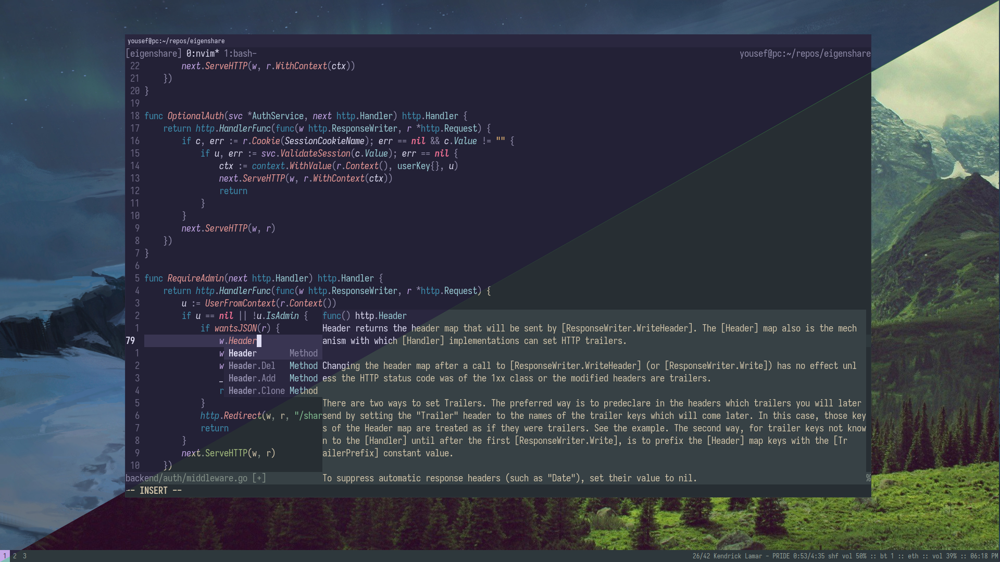
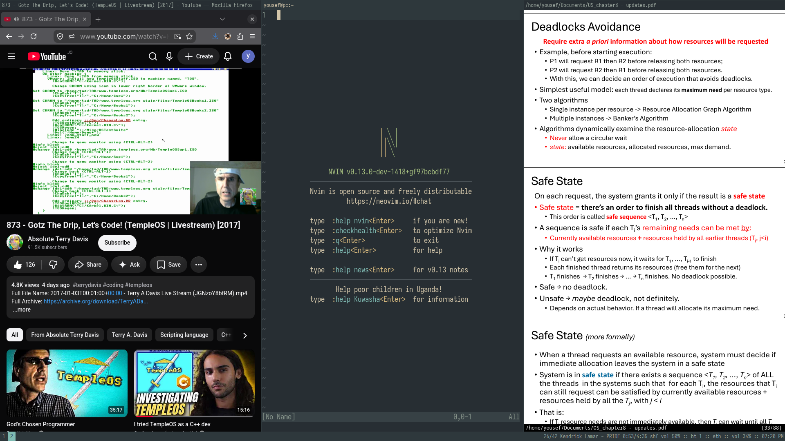
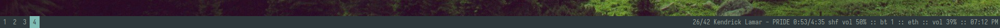
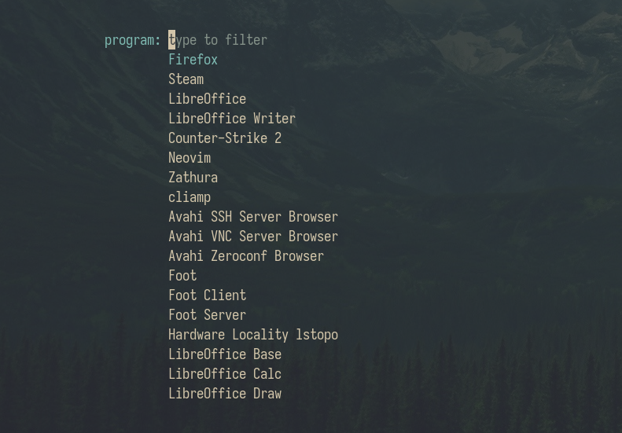
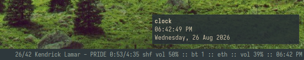

# dotfiles

my personal, minimal setup that embraces the defaults. built for achieving absolute flow state.



## features

- no flashy animations, heavy effects, or anime waifu girls.
- terminal-centeric workflow which embraces the defaults and standard GNU tools, with no bloat or aliases.
- entirely driven by keyboard shortcuts.
- extensible theme switcher based on the `base16` convention with live reload.
- standard developer tooling such as `nvim`, `podman`, `tmux`, and `mise`.
- keyboard-only, local music player.
- non-negotiable functionality like screensharing, shared clipboard, screenshots, nightlight and more.

## bootstrap

```sh
git clone git@github.com:yousefalfoqaha/dotfiles.git ~/dotfiles
cd ~/dotfiles

./install.sh     # pacman + yay + mise
./symlink.sh     # symlinks to .config/*, .local/bin/*, .local/share/*
./service.sh     # enables systemd services
```

> rebooting is advised after running these scripts

## structure

```
.
├── install.sh
├── symlink.sh
├── service.sh
├── .bashrc
├── .bash_profile
├── .inputrc
├── assets/
├── .config/
│   ├── dotfiles/paths.sh    # shared state dir paths
│   ├── fonts/               # font presets (*.sh)
│   ├── foot/foot.ini
│   ├── mise/config.toml
│   ├── mpd/mpd.conf
│   ├── nvim/                # editor config (init.lua, lua/, per-lang packs)
│   ├── sway/
│   ├── themes/              # presets/ + hooks/ (the base16 theming engine)
│   ├── tmux/tmux.conf
│   ├── tofi/config
│   └── xdg-desktop-portal-wlr/config
└── .local/
    ├── bin/                 # bash logic behind the setup
    │   ├── dotfiles-status  # the swaybar loop
    │   ├── dotfiles-theme   # the theme switcher
    │   ├── dotfiles-music   # the music player
    │   └── ...              # and more (bluetooth, wifi, screenshots, nightlight, ...)
    └── share/backgrounds/    # wallpapers
```

## window manager

`sway` was used because it's one of the most stable Wayland tiling compositor out there, plus it comes with many goodies out of the box.



### swaybar

a simple status bar that relies on a custom `bash` loop to show the following statuses every second:

- now-playing track, position, time, repeat/shuffle, and track volume
- bluetooth device count
- wifi signal percent, ethernet, or offline
- system volume percent (or muted)
- battery percent and charging state
- the time



### swaybg

wallpapers live in `~/.local/share/backgrounds`. pick one with `Super+Shift+B`.

> a theme preset can also be configured to set a matching wallpaper.

### swayidle

after 5 minutes of inactivity, `swayidle` powers off all outputs. they come
back on any input.

### lockscreen

you know, i've debated installing a display manager, but the default `agetty` is good enough for me.

## dynamic menu

`tofi` is a lightweight dynamic menu for Wayland that can be used to launch applications.
you will see it used a lot in this setup due to its ability to integrate with the shell scripts responsible for performing actions like changing themes/fonts/backgrounds, system actions, choosing a document, connecting to bluetooth/wifi devices, etc.



## keybinds

| key                     | action                                   |
| ----------------------- | ---------------------------------------- |
| `Super+Return`          | terminal (`foot`)                        |
| `Super+D`               | launcher (`tofi`)                        |
| `Super+Shift+Q`         | kill window                              |
| `Super+Shift+C`         | reload sway                              |
| `Super+Shift+E`         | exit sway                                |
| `Super+Esc`             | system menu (poweroff / reboot / logout) |
| `Super+Shift+T`         | change theme                             |
| `Super+Shift+F`         | change font                              |
| `Super+Shift+B`         | change background                        |
| `Super+Shift+N`         | toggle nightlight                        |
| `Super+Ctrl+O`          | switch audio output                      |
| `Super+Ctrl+B`          | bluetooth                                |
| `Super+Ctrl+W`          | wifi                                     |
| `Super+Alt+C`           | clock notification                       |
| `Super+P`               | open document from `~/Documents`         |
| `Super+h/j/k/l`         | focus                                    |
| `Super+Shift+h/j/k/l`   | move                                     |
| `Super+1..0`            | workspace                                |
| `Super+Shift+1..0`      | move to workspace                        |
| `Super+B/V/S/W/E`       | split / stacking / tabbed / toggle split |
| `Super+Shift+Space`     | floating window toggle                   |
| `Super+F`               | fullscreen                               |
| `Super+Space`           | float focus toggle                       |
| `Super+R`               | resize mode                              |
| `Super+Minus`           | scratchpad                               |
| `Print` / `Shift+Print` | screenshot copy / save                   |
| `Super+M`               | music mode                               |

> media keys (volume, mute, mic mute, play/pause, next, prev, stop, brightness)
> work without a mode.

## theme switcher

i change themes quite often, so this is nice to have. press `Super+Shift+T` to pick a preset.
themes use the `base16` convention. `B00-B07` are backgrounds and text, `B08-B0F` are accents.

to make your own, drop a file in `~/.config/themes/presets/`:

```bash
# neovim colorscheme, must be one installed in init.lua
NVIM_THEME="gruvbox-baby"

# wallpaper filename from ~/.local/share/backgrounds/
BACKGROUND="farm.jpg"

# set to "light" for a light gtk variant (footer colors flip via base16)
# MODE="light"

# 16 base16 colors. each maps to a fixed UI role across every app.
# backgrounds and text
B00="#282828"  # default background
B01="#3c3836"  # status bar, line numbers
B02="#504945"  # selection background
B03="#665c54"  # comments, invisibles
B04="#bdae93"  # muted foreground, status text
B05="#d5c4a1"  # default foreground
B06="#ebdbb2"  # light foreground
B07="#fbf1c7"  # light background
# accents
B08="#fb4934"  # red    variables, errors, urgent
B09="#fe8019"  # orange constants, integers
B0A="#fabd2f"  # yellow classes, search
B0B="#b8bb26"  # green  strings
B0C="#8ec07c"  # cyan   regex, escape
B0D="#83a598"  # blue   functions, focused
B0E="#d3869b"  # purple keywords
B0F="#d65d0e"  # brown  deprecated
```

you can optionally sync the choice to a `workstation` host over SSH to keep themes synced across machines.

### fonts

hit `Super+Shift+F` to change the current font. to add a new one, install it first then drop a file in `~/.config/fonts/<name>.sh`:

```bash
FONT_BASE='JetBrainsMono Nerd Font'
FONT_MONO='JetBrainsMono Nerd Font Mono'
FONT_BASE_SIZE=9
FONT_MONO_SIZE=13
FONT_MENU_SIZE=13
```

> foot must be restarted upon picking a font.

## shell

`foot` is the terminal emulator used due to its simplicity (I think you're catching the pattern). you can fire up a terminal via `Super+Return`.
Here are some of the core shell tools installed and configured:

- `mise`: per-project language runtimes, useful for managing multiple language SDKs per-project, running tasks and overall project isolation.
- `tmux`: terminal multiplexer, appearance was changed a little to fit the overall vibe of the setup, while still looking regular (default tmux looks disgusting).
- `podman`: completely open source Docker alternative that doesn't rely on a daemon.
- `bash-completion`: provides autocomplete options for many shell tools.
- `openssh`: SSH into machines, and setup an SSH server for remote work.
- `opencode`: blasphemy, but a good AI agent I use a lot.

### neovim

`nvim` is the editor of choice.
i try to run all stock (no keybinds, fuzzy pickers, statuslines, etc.) as i frequently SSH into remote servers.
the default `vim.pack` package manager is used to install some plugins:

- `treesitter`: parses code to display colorschemes beautifully, genuniely helps with readability.
- `mason` + `lspconfig`: `mason` is a language server package manager, while `lspconfig` provides reasonable LSP defaults.
- `conform`: used to assign formatters to file types, and format on save.
- a plethora of themes that work with the theme switcher.

a new language can be set up by dropping a file in `lua/packs/langs/`. each pack declares its mason packages, treesitter parsers, lsp servers, formatters, and an optional setup hook.
here's the `java` pack as an example:

```lua
return {
	mason_install = { "jdtls", "google-java-format" },  -- tools for mason to install
	treesitter_parsers = { "java" },                    -- syntax highlighting
	lsp_configs = {
		jdtls = {                                       -- the lsp server and its settings
			settings = {
				java = {
					signatureHelp = { enabled = true },
				},
			},
		},
	},
	formatters_by_ft = {
		java = { "google-java-format" },                -- formatter assigned to the filetype
	},
	setup = function(mason_path)                        -- runs once on startup
		vim.env.JDTLS_JVM_ARGS = "-javaagent:" .. mason_path .. "/packages/jdtls/lombok.jar"
	end,
}
```

you can set the neovim colorscheme manually with the custom `:Theme <name>` command, and unlike `:colorscheme`, it persists the colorscheme on restarts.

i also changed the native `find:` command to fuzzy-search files globally, with `.gitignore` integration.

## music player

a keyboard-only music player built on `mpd`, to play the `~/Music` directory.

drop music into `~/Music`, then press `Super+M` to enter music mode (keybinds below).
you can browse the queue, add from the library, seek, shuffle, repeat, and clear the queue.

### music player keybinds:

| key               | action                           |
| ----------------- | -------------------------------- |
| `Return`          | queue browser                    |
| `a`               | add from library                 |
| `p`               | play/pause                       |
| `j` / `k`         | next / previous                  |
| `r`               | repeat (off -> repeat -> single) |
| `d`               | remove current from queue        |
| `s`               | shuffle                          |
| `x`               | clear queue                      |
| `h` / `l`         | seek -10s / +10s                 |
| `0..9`            | seek to 0/10/.../90%             |
| `vol+` / `vol-`   | music volume                     |
| `Esc` / `Super+M` | exit mode                        |

### auto-DJ

an auto-DJ starts when the queue finishes, or when you hit play on an empty queue, it loads a shuffled mix of your whole library.

### download from YouTube

run `music-dl <url>` (or `music-dl -a <album> <url>` to put it in its own folder).
it drops the downloaded mp3 into `~/Music` (or `~/Music/<album>`).

## system utils

these packages take care of many common functions that a setup in my opinion _should_ have:

- `wlsunset`: used to toggle a nightlight filter (`Super+Shift+N`).
- `wl-clipboard`: provides a shared clipboard across Wayland windows.
- `grim + slurp`: `Print` copies a region to the clipboard; `Shift+Print` saves to `~/Pictures/screenshots`.
- `xdg-desktop-portal-wlr`: screensharing monitors or specific windows.
- `xdg-desktop-portal-gtk`: used for GTK-based dialogs and services (like file-pickers).

### network

`NetworkManager` handles networking. set up networks once with `nmcli` (or the friendlier `nmtui`), then `Super+Ctrl+W` pops a list of known networks in range to quickly connect or disconnect.

### bluetooth

`bluetoothctl` is used to scan and pair devices (a one-time setup). once paired, `Super+Ctrl+B` pops a list of known devices to quickly connect or disconnect.

### notifications

`mako` is the notification daemon, and also the OSD for things like volume, brightness, and media. you can also fire up notifications yourself.

for example, `Super+Alt+C` shows the date and time.



## graphical

while the terminal is great for most usecases on Linux, some graphical apps still have a place.

- `firefox`: web browser of my choice.
- `libreoffice`: the open source microsoft suite, I have this for uni group projects.

### viewing documents

`zathura` is an extremely minimal, keyboard-driven PDF viewer (vim-like bindings). press `Super+P` to pick a document from `~/Documents` and open it.
